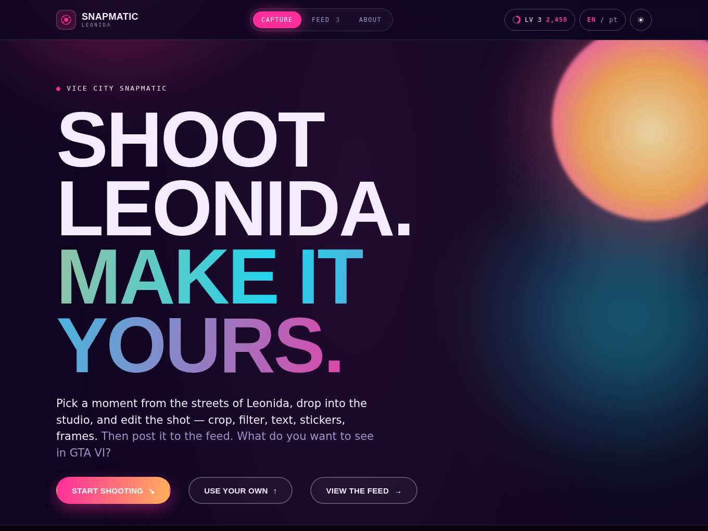

# 🌴 Vice City Snapmatic

An editorial, GTA VI–inspired **photo studio + social feed**, built for the **Build with React Image Editor Challenge** (`#BuiltWithImageEditor`).

Pick a moment from the streets of Leonida — or drop in **your own photo** — open it in **[Unlayer's React Image Editor](https://github.com/unlayer/react-image-editor)** (crop, filter, text, stickers, frames), then post your edited shot to a synthwave social feed with likes, reposts and a REP level system.



> 🔗 **Live demo:** https://vice-city-snapmatic.vercel.app · **Repo:** https://github.com/m4ik-crtl/vice-city-snapmatic
> *(update the live link with the exact URL Vercel gives you after deploy)*

---

## ✨ Features

- **React Image Editor at the core** — every moment opens in the full editor (crop, resize, filter, draw, text, shapes, stickers, frame).
- **Bring your own image** — upload any JPG / PNG / WEBP and edit it just like a moment.
- **13 real Leonida moments** — actual GTA VI stills as ready-to-edit backdrops.
- **Interactive Spotlight** — an auto-rotating, cinematic featured carousel (Ken Burns, controls, live badge).
- **Social feed** — Latest / Trending / Nearby tabs, category badges, a **REP + level** system that grows as you post, like and repost, a "SNAPMATIC CAM" watermark, and one-click PNG download.
- **Modals & lightbox** — quick-look a moment before editing, and open any snap full-screen.
- **Posting animation** — your shot "develops" with a progress bar before it hits the feed.
- **Day ☀ / Night ☾ themes** and **English / Português** — toggled live in the nav.
- Fully responsive, animated (scroll reveals, neon ambient background, synthwave grid), and it degrades gracefully if the editor's CDN can't be reached.

## 🧩 The core integration

`src/components/EditorView.tsx`:

```tsx
import ImageEditor, {
  type ImageEditorRef,
  type ImageEditorSaveResult,
} from '@unlayer/react-image-editor';

<ImageEditor
  ref={editorRef}
  image={scene.image}       // a bundled moment, or your uploaded data URL
  minHeight={680}
  options={{ theme /*, projectId */ }}
  onSave={(r: ImageEditorSaveResult) => setEdited(r.dataUrl)}
  onError={() => setFailed(true)}
/>
```

On post, the app grabs the freshest pixels via `editorRef.current?.editor?.getImage()`, attaches the caption + hashtags, and drops the result into the feed.

---

## 🚀 Run locally

Requires **[Node.js](https://nodejs.org) 18+**. Inside the project folder:

```bash
npm install
npm run dev
```

Open the printed URL (usually **http://localhost:5173**).

Production build:

```bash
npm run build     # type-checks + bundles into /dist
npm run preview   # serves the build
```

## 🤖 Optional: in-editor AI Assistant

The editor works with no account. To also enable the AI Assistant, create a free project at **[unlayer.com](https://unlayer.com)**, then:

```bash
cp .env.example .env
# set VITE_UNLAYER_PROJECT_ID=1234
```

> The editor loads its toolkit from Unlayer's CDN at runtime, so it needs an internet connection to appear.

---

## 🗂️ Structure

```
src/
├─ ui.tsx                 # theme + language context + EN/PT dictionary
├─ anim.tsx               # scroll-reveal hook + count-up
├─ components/
│  ├─ Nav.tsx             # aperture logo, segmented nav, REP chip
│  ├─ Spotlight.tsx       # cinematic featured carousel
│  ├─ Home.tsx            # hero · spotlight · moments · upload · about
│  ├─ EditorView.tsx      # ← React Image Editor (full-width studio)
│  ├─ Feed.tsx            # social feed + lightbox
│  ├─ Modal.tsx           # reusable modal
│  ├─ PostingOverlay.tsx  # "developing photo" post animation
│  ├─ Marquee.tsx · Footer.tsx
├─ data/scenes.ts         # the 13 moments (bilingual)
├─ App.tsx · types.ts · index.css
public/moments/           # the GTA VI stills (local → no CORS)
```

## 🛠️ Tech

React 18 · TypeScript · Vite 5 · [@unlayer/react-image-editor](https://www.npmjs.com/package/@unlayer/react-image-editor) · Archivo + Space Mono + Inter

## ✅ Challenge checklist

| Requirement | ✔ |
|---|---|
| Original GTA VI–inspired experience | Vice City Snapmatic |
| React Image Editor as a core part | every moment (and your uploads) open in it |
| Users edit/customize a visual | full editor per shot |
| Public GitHub repo | ✔ |
| Deployed | Vercel / Netlify configs included |
| `#BuiltWithImageEditor` | ✔ |

---

## 📄 License & credits

MIT — see [LICENSE](./LICENSE). Built by **[Maikon Silva](https://portfoliomaikon.netlify.app)**.

> Unofficial fan project. Not affiliated with Rockstar Games. The images in `/public/moments` are official *Grand Theft Auto VI* promotional stills © Rockstar Games, used here for a non-commercial fan project — swap them for your own captures in `src/data/scenes.ts`.
